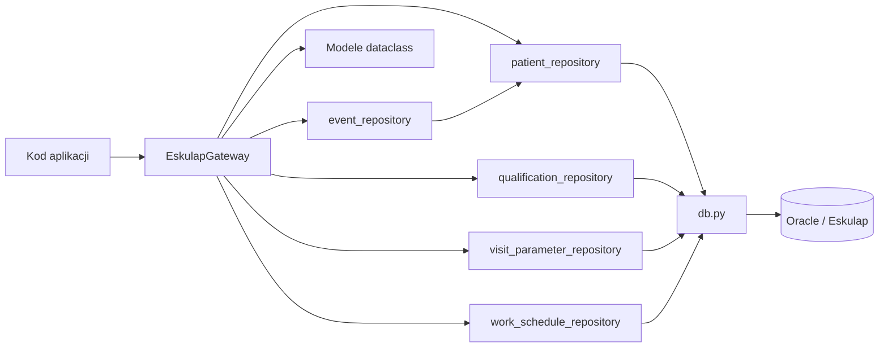

# Eskulap Gateway

`EskulapGateway` jest publiczną warstwą odczytu danych medycznych
z Eskulapa. Ukrywa przed kodem wywołującym repozytoria, SQL oraz nazwy
widoków Oracle.

Gateway nie otwiera połączeń i nie wykonuje SQL. Deleguje operacje do
istniejących repozytoriów, które korzystają z fabryki połączeń w `db.py`.
Warstwa nie zapisuje żadnych danych do Oracle.

Gateway zawsze pobiera aktualne dane pacjenta z Oracle.
KOMPAS nie utrzymuje własnej kopii danych osobowych. Model `Patient` jest
wyłącznie DTO przekazywanym w pamięci i nie jest zapisywany w PostgreSQL
ani w żadnej lokalnej bazie KOMPAS.

## Zależności



## Metody

### `search_patients(search_text)`

Wyszukuje pacjentów po fragmencie nazwiska lub numeru PESEL. Zwraca
listę `Patient`.

### `get_patient(patient_id)`

Pobiera jednego pacjenta. Zwraca `Patient` albo `None`.

### `get_patient_visits(patient_id)`

Pobiera wizyty pacjenta. Zwraca listę `Visit`. Model zawiera także pola
`parametr_kod`, `parametr_nazwa` i `parametr_czy_aktualne`, mapowane
odpowiednio z `WP_PARAMETR` i słownika `CG_REF_CODES`.
Jeżeli widok `V_KOMPAS_WIZYTY` zwraca wizytę zaplanowaną bez `DATA_WIZYTY`,
Gateway przekazuje `DATA_PLANOWANA` albo, dla starszego wariantu widoku,
`DATA_WIZYTY_DO` jako `Visit.planned_date`.

### `get_patient_qualification_visits(date_from=None, date_to=None, only_unassigned=True)`

Pobiera wizyty kwalifikacyjne PKK z opcjonalnego okresu. Parametr
`only_unassigned` ogranicza wynik do wizyt bez epizodu KOMPAS. Zwraca
listę `QualificationVisit`. Wizyta kwalifikacyjna jest rozpoznawana po
aktywnych kodach przypisanych do klocka `PKK_KWAL` w tabeli
`pk_mapowanie_wizyt`. Gateway nie zawiera stałego warunku dla `F18`.

### `get_patient_consultations(patient_id)`

Pobiera konsultacje pacjenta. Zwraca listę `Consultation`.
Konsultacja z samą datą planowaną trafia do modelu jako `planned_date`;
`event_date` oznacza przyjęcie/realizację, a nie samo zaplanowanie.

### `get_patient_laboratory_orders(patient_id)`

Pobiera zlecenia badań laboratoryjnych. Zwraca listę
`LaboratoryOrder`.

### `get_patient_imaging_orders(patient_id)`

Pobiera zlecenia badań obrazowych. Zwraca listę `ImagingOrder`.

### `list_organizational_units(search_text=None)`

Pobiera jednostki organizacyjne ze źródła harmonogramu wskazanego przez
`application.view_name` w `config.ini`. Opcjonalnie filtruje po
identyfikatorze, symbolu lub nazwie. Zwraca listę `OrganizationalUnit`
z polami `jo_id`, `jo_symbol` i `jo_nazwa`. Operacja korzysta wyłącznie
z instrukcji `SELECT`.

### `list_visit_parameters(only_active=True)`

Pobiera referencyjny słownik rodzajów wizyt z tylko do odczytu widoku
`ESK_RAPORTY.V_KOMPAS_PARAMETRY_WIZYT`. Zwraca listę `VisitParameter`
z kodem, nazwą i informacją o aktualności. Dane słownika nie są kopiowane
do PostgreSQL; KOMPAS zapisuje wyłącznie wybrane przypisania kodów do
klocków.

### `get_work_schedule(jo_id, date_from, date_to, employee_ids=None)`

Pobiera plan pracy z Eskulapa dla wskazanej jednostki i zakresu dat.
Opcjonalnie ogranicza wynik do listy pracowników. Zwraca listę
`WorkScheduleEntry` z polami:

- `jo_id`,
- `jo_symbol`,
- `jo_nazwa`,
- `data_dnia`,
- `data_tekst`,
- `dzien_tyg`,
- `pracownik_id`,
- `pracownik`,
- `godz_od`,
- `godz_do`,
- `pln_id`,
- `pln_opis`,
- `rodzaje_wizyt_kody`,
- `rodzaje_wizyt_lista`.

Metoda korzysta z widoku `ESK_RAPORTY.V_KOMPAS_PLAN_PRACY_KALENDARZ` przez
wewnętrzne repozytorium Gateway. Moduł Harmonogram pracy nie łączy się
bezpośrednio z Oracle i nie zna danych połączenia.

#### Źródło danych harmonogramu pracy

Zatwierdzonym źródłem danych harmonogramu jest widok tylko do odczytu:

```text
ESK_RAPORTY.V_KOMPAS_PLAN_PRACY_KALENDARZ
```

Widok jest wskazywany przez `application.view_name` w `config.ini`; wartość
domyślna oraz wartość udokumentowana dla KOMPAS to
`ESK_RAPORTY.V_KOMPAS_PLAN_PRACY_KALENDARZ`.

`work_schedule_repository` używa kolumn:

- `JO_ID`,
- `JO_SYMBOL`,
- `JO_NAZWA`,
- `DATA_DNIA`,
- `DATA_TEKST`,
- `DZIEN_TYG`,
- `PRACOWNIK_ID`,
- `PRACOWNIK`,
- `GODZ_OD`,
- `GODZ_DO`,
- `PLN_ID`,
- `PLN_OPIS`,
- `RODZAJE_WIZYT_KODY`,
- `RODZAJE_WIZYT`.

Filtrowanie odbywa się po `JO_ID`, zakresie `DATA_DNIA` oraz opcjonalnie po
`PRACOWNIK_ID`. KOMPAS wykonuje wyłącznie `SELECT`; żadne dane planu pracy
nie są zapisywane do Oracle.

`RODZAJE_WIZYT_KODY` zawiera zagregowane, unikalne kody
`WP_PARAMETR`, a `RODZAJE_WIZYT` zawiera odpowiadające im nazwy z
`V_KOMPAS_PARAMETRY_WIZYT`.
Popup kalendarza pokazuje użytkownikowi `RODZAJE_WIZYT`; kody pozostają
danymi technicznymi do diagnostyki i fallbacku.
`RI_PLAN_PRACY_WARUNKI_NEW.PLW_WP_PARAMETR` dla danego `PLN_ID`.
Gateway rozdziela kody na `rodzaje_wizyt_lista`, a nazwy z Oracle na
`rodzaje_wizyt_nazwy_lista`. `ScheduleService` preferuje nazwy z
`RODZAJE_WIZYT`; lokalny słownik PostgreSQL jest używany tylko jako fallback,
gdy widok Oracle nie zwróci nazw.

### `get_visit_type_availability(jo_id, date_from, date_to, visit_type_codes=None)`

Pobiera szczegółową dostępność rodzajów wizyt dla jednostki i zakresu dat.
Zwraca listę `VisitTypeAvailabilityRecord` z polami:

- `jo_id`,
- `jo_symbol`,
- `jo_nazwa`,
- `data_dnia`,
- `pracownik_id`,
- `pracownik`,
- `pln_id`,
- `plw_id`,
- `parametr_kod`,
- `parametr_nazwa`,
- `godz_od`,
- `godz_do`,
- `minuta_od`,
- `minuta_do`.

Metoda korzysta wyłącznie z widoku
`ESK_RAPORTY.V_KOMPAS_DOSTEPNOSC_RODZAJOW_WIZYT`. Gateway zwraca rekordy
szczegółowe i nie wykonuje pivotu miesięcznego. Macierz miesięczna oraz
scalanie zakresów godzinowych są wykonywane dopiero w `ScheduleService`.

Przepływ danych:

```text
RI_PLAN_PRACY_NEW
        +
RI_PLAN_PRACY_WARUNKI_NEW
        +
V_KOMPAS_PARAMETRY_WIZYT
        ↓
V_KOMPAS_DOSTEPNOSC_RODZAJOW_WIZYT
        ↓
EskulapGateway
        ↓
ScheduleService
        ↓
Zakładka „Dostępność rodzajów wizyt”
        ↓
Popup szczegółów
```

Widok normalizuje kody `WP_PARAMETR`, np. `F1` → `F01`, i zwraca wyłącznie
kody z zakresu `F01`–`F18`.

### Synchronizacja epizodów

`EpisodeSynchronizationService` pobiera wizyty pacjentów przez
`EskulapGateway.get_patient_visits(patient_id, date_from=None, date_to=None)`.
Gateway zwraca `Visit.status` na podstawie kolumny `DECYZJA` z widoku
`V_KOMPAS_WIZYTY` oraz `parametr_kod`/`parametr_nazwa`. Kolumna `DECYZJA` jest
aliasem pola `RI_WIZYTY_W_PORADNIACH.WP_DECYZJA`.
Repozytoria filtrują wizyty po `COALESCE(DATA_WIZYTY, DATA_WIZYTY_DO)`, a
konsultacje po `COALESCE(DATA_PRZYJECIA, DATA_KONSULTACJI, DATA_PLANOWANA)`,
więc wpisy zaplanowane w Eskulapie są widoczne w szczegółach epizodu jeszcze
przed realizacją.
Klocek `KONSULTACJA_SPECJALISTYCZNA` jest zasilany wyłącznie danymi z widoku
`V_KOMPAS_KONSULTACJE`. Nie jest uzupełniany przez mapowanie rodzajów wizyt
`WP_PARAMETR -> klocek`, nawet jeśli administrator omyłkowo utworzy takie
mapowanie. Klocki wizytowe o nazwach zaczynających się od `KONSULTACJA_`, np.
psychiatryczne lub psychologiczne, nadal mogą być zasilane z `V_KOMPAS_WIZYTY`,
jeżeli są mapowane przez `pk_mapowanie_wizyt`.

Klocek `BADANIE_OBRAZOWE` jest zasilany wyłącznie z listy badań obrazowych
zwracanej przez `EskulapGateway.get_patient_imaging_orders()`, czyli przez
widok `V_KOMPAS_BADANIA` z filtrem typu badania obrazowego. Nie jest
uzupełniany przez wizyty ani konsultacje.

### Zasada 1 zdarzenie Eskulapa = 1 element epizodu

Dla konsultacji specjalistycznych i badań obrazowych synchronizacja działa
według zasady 1:1:

```text
zdarzenie Eskulapa
        ↓
pk_epizod_elementy
        ↓
pk_zadania
```

Jeżeli Eskulap zwróci więcej konsultacji specjalistycznych albo badań
obrazowych niż istnieje aktywnych elementów danego klocka w epizodzie,
`EpisodeSynchronizationService` tworzy dodatkowe elementy tylko w bieżącym
epizodzie. Szablon ścieżki w `pk_sciezka_elementy` nie jest modyfikowany.

Automatycznie utworzony element otrzymuje:

- `typ_pochodzenia = POWIELENIE_AUTOMATYCZNE`,
- `element_zrodlowy_id` wskazujący element źródłowy,
- wpis historii `POWIELENIE_AUTOMATYCZNE`,
- powiązane zadanie w `pk_zadania`.

Powiązanie ze zdarzeniem Eskulapa jest zapisane w `pk_zadania` w polach
`eskulap_system` i `eskulap_id`. Baza PostgreSQL posiada częściowy indeks
unikalny `uq_pk_zadania_eskulap_event`, który blokuje przypisanie tego samego
zdarzenia Eskulapa do wielu zadań KOMPAS.

Status elementu nadal wylicza `EpisodeStateService`:

- zdarzenie bez daty planowanej i bez daty realizacji → `DO_ZAPLANOWANIA`,
- zdarzenie z datą planowaną i bez realizacji → `ZAPLANOWANA`,
- zdarzenie z datą realizacji → `ZREALIZOWANA`,
- zdarzenie anulowane w Eskulapie → `ANULOWANA`.

`EpisodeSynchronizationService` zapisuje powiązanie wizyty z elementem
epizodu, a `EpisodeStateService` wylicza z tych danych aktualny stan.
KOMPAS nie wykonuje żadnych zapisów do Oracle.

## Użycie

```python
from app.gateway.eskulap_gateway import EskulapGateway

gateway = EskulapGateway()
patients = gateway.search_patients("Kowalski")

if patients:
    patient = gateway.get_patient(patients[0].patient_id)
    visits = gateway.get_patient_visits(patient.patient_id)
```

Gateway zwraca dataclassy, a nie `DataFrame` ani surowe wiersze Oracle.
Pola modeli mają stabilne angielskie nazwy, niezależne od nazw kolumn
źródłowych, np. `patient_id`, `first_name`, `visit_date`.

## Wymagane widoki Oracle

Gateway wymaga widoków:

- `ESK_RAPORTY.V_KOMPAS_PACJENCI`,
- `ESK_RAPORTY.V_KOMPAS_WIZYTY`,
- `ESK_RAPORTY.V_KOMPAS_PARAMETRY_WIZYT`,
- `ESK_RAPORTY.V_KOMPAS_KONSULTACJE`,
- `ESK_RAPORTY.V_KOMPAS_BADANIA`.

Moduł Harmonogram pracy wymaga dodatkowo widoku:

- `ESK_RAPORTY.V_KOMPAS_PLAN_PRACY_KALENDARZ`.
- `ESK_RAPORTY.V_KOMPAS_DOSTEPNOSC_RODZAJOW_WIZYT`.

Badania laboratoryjne i obrazowe korzystają ze wspólnego widoku
`V_KOMPAS_BADANIA` i są rozdzielane według typu badania.

`RI_WIZYTY_W_PORADNIACH.WP_PARAMETR` przechowuje kod rodzaju wizyty.
Słownik `CG_REF_CODES` dla `RV_DOMAIN = 'PARAMETRY'` opisuje te kody:
`RV_LOW_VALUE` odpowiada wartości `WP_PARAMETR`, `RV_MEANING` jest nazwą
wizyty, porady, sesji lub terapii, a `RV_CZY_AKTUALNE` określa aktualność
kodu. Widok `V_KOMPAS_PARAMETRY_WIZYT` udostępnia ten słownik wyłącznie
do odczytu.

Wizyty kwalifikacyjne nie mają osobnego widoku. Gateway pobiera je
z `V_KOMPAS_WIZYTY`, a lista dopuszczonych wartości `PARAMETR_KOD`
pochodzi z aktywnych rekordów `pk_mapowanie_wizyt` przypisanych do
`PKK_KWAL`. Seed PostgreSQL tworzy początkowe mapowanie `F18`, ale
administrator może dopisać kolejne kody bez zmiany aplikacji.

W modelu procesu `PKK` pozostaje typem elementu. Klocek `PKK_KWAL`
reprezentuje wizytę kwalifikacyjną F18, a `PKK_WIZ` zwykłą wizytę lub
czynność organizacyjną PKK w trakcie programu.
Klocki typu wizyta, sesja i terapia mogą być mapowane do wielu wartości
`parametr_kod` wybieranych z `V_KOMPAS_PARAMETRY_WIZYT` w module
„Administracja → Ustawienia systemu → Integracja Eskulap”. Jeden klocek może
mieć wiele aktywnych rodzajów wizyt, ale jeden rodzaj wizyty może mieć tylko
jedno aktywne przypisanie do klocka.
Techniczna wartość `source_type = WIZYTA_KWALIFIKACYJNA_PKK` opisuje
pochodzenie epizodu i nie jest kodem klocka.

Po każdej zmianie pliku `docs/SQL/kompas_oracle_views.sql` administrator
musi ręcznie wykonać odpowiednie instrukcje `CREATE OR REPLACE VIEW`
w Oracle. Aktualizacja pliku w projekcie nie modyfikuje bazy Oracle.

## Test ręczny

```text
python scripts/test_gateway.py Kowalski
python scripts/test_gateway.py 90010112345 --date-from 2026-01-01
```

Test wymaga poprawnego `config.ini`, dostępu do Oracle oraz wdrożonych
widoków `ESK_RAPORTY.V_KOMPAS_*`.
## Słownik rodzajów wizyt i lokalne mapowania

Gateway udostępnia metodę `list_visit_parameters(only_active=True)`, która
czyta wyłącznie widok Oracle `ESK_RAPORTY.V_KOMPAS_PARAMETRY_WIZYT`.
Synchronizacja do PostgreSQL odbywa się poza Gateway, w serwisie
`VisitTypeDictionarySyncService`, i zapisuje dane referencyjne do
`pk_rodzaje_wizyt_eskulap`.

Mapowanie `WP_PARAMETR -> klocek KOMPAS` jest przechowywane w PostgreSQL w
`pk_mapowanie_wizyt`, które wskazuje lokalny rekord
`pk_rodzaje_wizyt_eskulap`. Gateway nie zapisuje do Oracle i nie edytuje
słownika Eskulapa.
