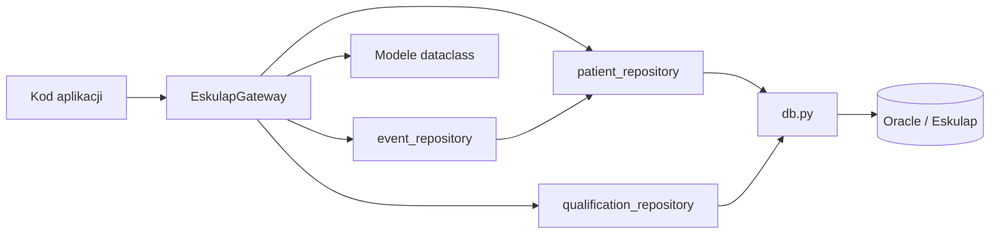

# Eskulap Gateway

`EskulapGateway` jest publiczną warstwą odczytu danych medycznych
z Eskulapa. Ukrywa przed kodem wywołującym repozytoria, SQL oraz nazwy
widoków Oracle.

Gateway nie otwiera połączeń i nie wykonuje SQL. Deleguje operacje do
istniejących repozytoriów, które korzystają z fabryki połączeń w `db.py`.
Warstwa nie zapisuje żadnych danych do Oracle.

Gateway zawsze pobiera aktualne dane pacjenta z Oracle.
KOMPAS nie utrzymuje własnej kopii danych osobowych. Model `Patient` jest
wyłącznie DTO przekazywanym w pamięci i nie jest zapisywany w PostgreSQL
ani SQLite.

## Zależności



## Metody

### `search_patients(search_text)`

Wyszukuje pacjentów po fragmencie nazwiska lub numeru PESEL. Zwraca
listę `Patient`.

### `get_patient(patient_id)`

Pobiera jednego pacjenta. Zwraca `Patient` albo `None`.

### `get_patient_visits(patient_id)`

Pobiera wizyty pacjenta. Zwraca listę `Visit`.

### `get_patient_qualification_visits(date_from=None, date_to=None, only_unassigned=True)`

Pobiera wizyty kwalifikacyjne PKK z opcjonalnego okresu. Parametr
`only_unassigned` ogranicza wynik do wizyt bez epizodu KOMPAS. Zwraca
listę `QualificationVisit`.

### `get_patient_consultations(patient_id)`

Pobiera konsultacje pacjenta. Zwraca listę `Consultation`.

### `get_patient_laboratory_orders(patient_id)`

Pobiera zlecenia badań laboratoryjnych. Zwraca listę
`LaboratoryOrder`.

### `get_patient_imaging_orders(patient_id)`

Pobiera zlecenia badań obrazowych. Zwraca listę `ImagingOrder`.

### `list_organizational_units(search_text=None)`

Pobiera jednostki organizacyjne ze źródła harmonogramu wskazanego przez
`application.view_name` w `config.ini`. Opcjonalnie filtruje po
identyfikatorze, symbolu lub nazwie. Zwraca listę `OrganizationalUnit`
z polami `jo_id`, `jo_symbol` i `jo_nazwa`. Operacja korzysta wyłącznie
z instrukcji `SELECT`.

## Użycie

```python
from app.gateway.eskulap_gateway import EskulapGateway

gateway = EskulapGateway()
patients = gateway.search_patients("Kowalski")

if patients:
    patient = gateway.get_patient(patients[0].patient_id)
    visits = gateway.get_patient_visits(patient.patient_id)
```

Gateway zwraca dataclassy, a nie `DataFrame` ani surowe wiersze Oracle.
Pola modeli mają stabilne angielskie nazwy, niezależne od nazw kolumn
źródłowych, np. `patient_id`, `first_name`, `visit_date`.

## Wymagane widoki Oracle

Gateway wymaga widoków:

- `ESK_RAPORTY.V_KOMPAS_PACJENCI`,
- `ESK_RAPORTY.V_KOMPAS_WIZYTY`,
- `ESK_RAPORTY.V_KOMPAS_KONSULTACJE`,
- `ESK_RAPORTY.V_KOMPAS_BADANIA`.

Badania laboratoryjne i obrazowe korzystają ze wspólnego widoku
`V_KOMPAS_BADANIA` i są rozdzielane według typu badania.

Wizyty kwalifikacyjne nie mają osobnego widoku. Gateway pobiera je
z `V_KOMPAS_WIZYTY`, filtrując pola `TYP_WIZYTY`, `PORADNIA_SYMBOL`,
`PORADNIA_NAZWA` i `OPIS`. Początkowe wartości filtra
(`kwalifikacja`, `PKK`, `kwalifikacyjna`) są konfigurowane w
`qualification_repository.py`.

Po każdej zmianie pliku `docs/SQL/kompas_oracle_views.sql` administrator
musi ręcznie wykonać odpowiednie instrukcje `CREATE OR REPLACE VIEW`
w Oracle. Aktualizacja pliku w projekcie nie modyfikuje bazy Oracle.

## Test ręczny

```text
python scripts/test_gateway.py Kowalski
python scripts/test_gateway.py 90010112345 --date-from 2026-01-01
```

Test wymaga poprawnego `config.ini`, dostępu do Oracle oraz wdrożonych
widoków `ESK_RAPORTY.V_KOMPAS_*`.
