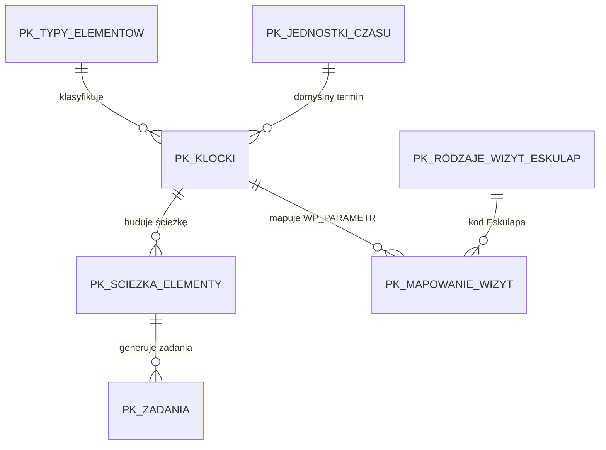

# Słowniki biznesowe KOMPAS

Status: aktualne po ADM-DICT-5.

## Zasada główna

Typ klocka jest podstawowym i jedynym mechanizmem klasyfikacji elementów
procesu w KOMPAS.

Mechanizm grup klocków został usunięty. W nowych skryptach inicjalizacyjnych
nie występuje tabela `pk_grupy_klockow`, kolumna `grupa_id` ani sortowanie po
grupach.

## Diagram zależności



## Typy klocków

Docelowe typy elementów procesu:

| Kod | Znaczenie |
| --- | --- |
| `PKK` | Elementy Punktu Konsultacyjno-Koordynacyjnego |
| `WIZYTA` | Wizyty, konsultacje psychologiczne/psychiatryczne i sesje |
| `KONSULTACJA` | Konsultacje specjalistyczne |
| `BADANIE_LAB` | Badania laboratoryjne |
| `BADANIE_GEN` | Badania genetyczne |
| `BADANIE_OBRAZOWE` | Badania obrazowe |
| `SUPERWIZJA` | Superwizja |
| `KONSYLIUM` | Konsylium |
| `ZAKONCZENIE` | Zakończenie programu |

Usunięte typy:

- `SESJA`
- `DOKUMENT`
- `RAPORT`

Sesje są obecnie klasyfikowane jako typ `WIZYTA`, ponieważ w procesie KOMPAS
ich dalsze rozróżnienie wynika z konkretnego klocka i mapowania rodzajów wizyt
Eskulapa.

## Biblioteka klocków

Docelowa biblioteka startowa zawiera wyłącznie:

| Typ | Kod klocka | Nazwa |
| --- | --- | --- |
| `PKK` | `PKK_KWAL` | Wizyta kwalifikacyjna w PKK |
| `PKK` | `PKK_WIZ` | Wizyta w PKK |
| `WIZYTA` | `KONSULTACJA_PSYCHIATRYCZNA_KOMPLEKSOWA` | Konsultacja psychiatryczna kompleksowa |
| `WIZYTA` | `KONSULTACJA_PSYCHIATRYCZNA_TERAPEUTYCZNA` | Konsultacja psychiatryczna terapeutyczna |
| `WIZYTA` | `KONSULTACJA_PSYCHIATRYCZNA_DIAGNOSTYCZNA` | Konsultacja psychiatryczna diagnostyczna |
| `WIZYTA` | `KONSULTACJA_TERAPEUTY_SRODOWISKOWEGO` | Konsultacja terapeuty środowiskowego |
| `WIZYTA` | `KONSULTACJA_PSYCHOLOGICZNA_DIAGNOSTYCZNA` | Konsultacja psychologiczna diagnostyczna |
| `WIZYTA` | `KONSULTACJA_PSYCHOLOGICZNA_TERAPEUTYCZNA` | Konsultacja psychologiczna terapeutyczna |
| `WIZYTA` | `KONSULTACJA_PSYCHOTERAPEUTYCZNA_DIAGNOSTYCZNA` | Konsultacja psychoterapeutyczna diagnostyczna |
| `WIZYTA` | `KONSULTACJA_PSYCHOTERAPEUTYCZNA_TERAPEUTYCZNA` | Konsultacja psychoterapeutyczna terapeutyczna |
| `WIZYTA` | `SESJA_TERAPEUTYCZNA` | Sesja terapeutyczna |
| `WIZYTA` | `SESJA_TERAPEUTYCZNA_GRUPOWA` | Sesja terapeutyczna grupowa |
| `WIZYTA` | `SESJA_PSYCHOLOGICZNA` | Sesja psychologiczna |
| `WIZYTA` | `SESJA_PSYCHOLOGICZNA_GRUPOWA` | Sesja psychologiczna grupowa |
| `WIZYTA` | `SESJA_PSYCHOTERAPEUTYCZNA` | Sesja psychoterapeutyczna |
| `WIZYTA` | `SESJA_PSYCHOTERAPEUTYCZNA_GRUPOWA` | Sesja psychoterapeutyczna grupowa |
| `KONSULTACJA` | `KONSULTACJA_SPECJALISTYCZNA` | Konsultacja specjalistyczna |
| `BADANIE_LAB` | `BADANIA_LABORATORYJNE` | Badania laboratoryjne |
| `BADANIE_OBRAZOWE` | `BADANIE_OBRAZOWE` | Badanie obrazowe |
| `SUPERWIZJA` | `SUPERWIZJA` | Superwizja |
| `KONSYLIUM` | `KONSYLIUM` | Konsylium |
| `ZAKONCZENIE` | `ZAKONCZENIE_PROGRAMU` | Zakończenie programu |
| `BADANIE_GEN` | `BADANIA_GENETYCZNE` | Badania genetyczne |

Usunięte klocki:

- `RAPORT_KONCOWY`
- `DIAGNOSTYKA_PSYCHOLOGICZNA`

Nie pozostają one jako nieaktywne rekordy w nowych skryptach
inicjalizacyjnych.

### Klocki zasilane bezpośrednio ze zdarzeń Eskulapa

Nie wszystkie klocki są zasilane przez mapowanie `WP_PARAMETR -> klocek`.
Dla dwóch typów procesu obowiązuje osobne źródło:

- `KONSULTACJA_SPECJALISTYCZNA` — wyłącznie widok
  `ESK_RAPORTY.V_KOMPAS_KONSULTACJE`,
- `BADANIE_OBRAZOWE` — wyłącznie widok `ESK_RAPORTY.V_KOMPAS_BADANIA`
  przez `EskulapGateway.get_patient_imaging_orders()`.

Dla tych klocków w epizodzie obowiązuje zasada:

```text
1 zdarzenie Eskulapa = 1 element epizodu = 1 zadanie KOMPAS
```

Jeżeli Eskulap zwróci więcej konsultacji specjalistycznych albo badań
obrazowych niż przewiduje bazowa ścieżka, KOMPAS tworzy dodatkowe elementy
wyłącznie w danym epizodzie. Powielony element ma
`typ_pochodzenia = POWIELENIE_AUTOMATYCZNE` i wskazuje swój
`element_zrodlowy_id`. Definicja ścieżki programu nie jest zmieniana.

## Projekt tabel PostgreSQL

### `pk_typy_elementow`

```sql
CREATE TABLE pk_typy_elementow (
    typ_id bigint GENERATED BY DEFAULT AS IDENTITY PRIMARY KEY,
    kod text NOT NULL UNIQUE,
    nazwa text NOT NULL,
    opis text,
    kolejnosc integer NOT NULL DEFAULT 0,
    czy_aktywny integer NOT NULL DEFAULT 1,
    czy_systemowy integer NOT NULL DEFAULT 0,
    ikona text,
    kolor text,
    created_at timestamptz NOT NULL DEFAULT now(),
    updated_at timestamptz
);
```

### `pk_klocki`

```sql
CREATE TABLE pk_klocki (
    klocek_id bigint GENERATED BY DEFAULT AS IDENTITY PRIMARY KEY,
    kod text NOT NULL UNIQUE,
    nazwa text NOT NULL,
    opis text,
    typ_elementu_id bigint NOT NULL REFERENCES pk_typy_elementow(typ_id),
    ikona text,
    kolor text NOT NULL DEFAULT '#828282',
    kolor_tekstu text NOT NULL DEFAULT '#FFFFFF',
    domyslny_termin_liczba integer,
    domyslna_jednostka_czasu_id bigint REFERENCES pk_jednostki_czasu(jednostka_czasu_id),
    czy_wymaga_zlecenia integer NOT NULL DEFAULT 0,
    czy_obowiazkowy integer NOT NULL DEFAULT 0,
    czy_aktywny integer NOT NULL DEFAULT 1,
    czy_systemowy integer NOT NULL DEFAULT 0,
    kolejnosc integer NOT NULL DEFAULT 0,
    created_at timestamptz NOT NULL DEFAULT now(),
    updated_at timestamptz
);
```

### `pk_jednostki_czasu`

Jednostki czasu pozostają słownikiem pomocniczym dla terminów:

- `DZIEN`
- `TYDZIEN`
- `MIESIAC`

## Zasady edycji

- Kod systemowy słownika jest niezmienny.
- Administrator może docelowo edytować nazwę, opis, kolor, ikonę, kolejność i
  aktywność.
- Rekord użyty w programie, ścieżce lub epizodzie nie powinien być usuwany.
  Dopuszczalna jest dezaktywacja.
- Klocki systemowe z seedów są punktem startowym, ale docelowo mogą być
  rozszerzane przez administratora w module Ustawienia systemu.

## Mapowanie rodzajów wizyt Eskulapa

KOMPAS nie kopiuje pełnego słownika rodzajów wizyt Eskulapa jako danych
medycznych. Lokalnie utrzymywane są wyłącznie techniczne przypisania:

```text
WP_PARAMETR
    ↓
pk_rodzaje_wizyt_eskulap
    ↓
pk_mapowanie_wizyt
    ↓
pk_klocki
```

Przykład startowy:

- `PKK_KWAL` → `F18` → wizyta kwalifikacyjna PKK.

## Wdrożenie

Nie przygotowuje się migracji danych produkcyjnych. Po tej zmianie baza testowa
PostgreSQL powinna zostać odtworzona od zera z aktualnych skryptów
`db/postgres/`.
