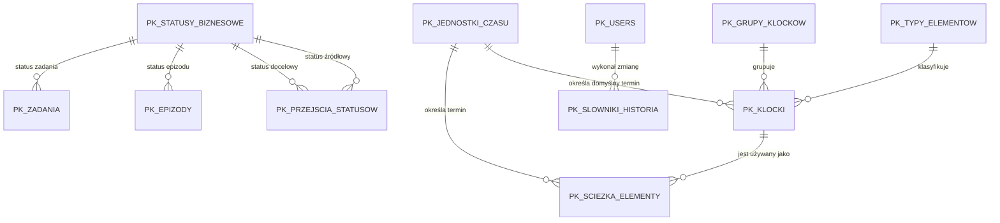

# Docelowy model słowników biznesowych KOMPAS

Status dokumentu: **projekt architektury — bez implementacji**

Dokument opisuje docelowy model PostgreSQL dla modułu
„Administracja → Ustawienia systemu → Słowniki”. Nie jest migracją i nie
zmienia obecnego schematu ani działania aplikacji.

PostgreSQL jest docelowym źródłem słowników KOMPAS. SQLite otrzyma
równoważny model wyłącznie jako środowisko developerskie, nie jako drugie
niezależne źródło konfiguracji produkcyjnej.

## 1. Zasady wspólne

Każdy rekord słownikowy posiada:

- niezmienny kod zapisany wielkimi literami, bez spacji i polskich znaków;
- nazwę prezentowaną użytkownikowi;
- opcjonalny opis;
- kolejność prezentacji;
- flagę aktywności;
- opcjonalną ikonę;
- opcjonalny kolor prezentacji w formacie `#RRGGBB`;
- flagę rekordu systemowego;
- datę utworzenia i modyfikacji.

Kod jest niezmienny zarówno dla rekordu systemowego, jak i biznesowego.
Administrator podaje kod podczas tworzenia, ale nie może później go zmienić.
Niezmienność egzekwuje repozytorium oraz trigger `BEFORE UPDATE OF kod`.
Zmiana kodu wymaga kontrolowanej migracji.

Rekordy systemowe sterują logiką aplikacji. Administrator może zmieniać ich
nazwę, opis, ikonę, kolor i kolejność, lecz nie kod ani znaczenie. Rekord
systemowy wymagany przez algorytm nie może zostać dezaktywowany.

Rekord używany przez program, ścieżkę lub epizod:

- nie może zostać fizycznie usunięty;
- może zostać dezaktywowany, jeśli nie narusza działania aktywnego procesu;
- po dezaktywacji pozostaje widoczny w danych historycznych;
- nie jest dostępny przy tworzeniu nowych konfiguracji.

Interfejs aplikacji nie powinien wykonywać `DELETE` na słownikach. Fizyczne
usuwanie nieużytego rekordu może być wyłącznie operacją serwisową. Relacje
PostgreSQL używają `ON DELETE RESTRICT`.

## 2. Diagram zależności



Relacja klocka z typem, grupą i jednostką czasu dotyczy wartości domyślnych.
Po dodaniu klocka do ścieżki jego ustawienia są kopiowane do
`pk_sciezka_elementy`. Późniejsza zmiana słownika nie modyfikuje istniejącej
ścieżki ani utworzonych epizodów.

## 3. Macierz pól i uprawnień

| Pole | Administrator | System |
|---|---|---|
| `kod` | Ustawia tylko przy tworzeniu | Niezmienny identyfikator kontraktu |
| `nazwa` | Edycja | Odczyt |
| `opis` | Edycja | Odczyt |
| `kolejnosc` | Edycja | Domyślne sortowanie |
| `czy_aktywny` | Aktywacja/dezaktywacja z walidacją użycia | Może blokować dezaktywację wartości wymaganej |
| `ikona` | Edycja | Opcjonalny zasób prezentacyjny |
| `kolor` | Edycja | Walidacja `#RRGGBB` |
| `czy_systemowy` | Brak edycji | Nadawane przez seed lub migrację |
| `created_at`, `updated_at` | Brak edycji | Ustawiane automatycznie |

Pola techniczne określające sposób obliczania lub zachowanie generatora są
systemowe nawet wtedy, gdy administrator może edytować nazwę rekordu.

---

## 4. Typy elementów procesu

### Przeznaczenie

Typ elementu opisuje klasę czynności w procesie. Jest stabilnym
identyfikatorem wykorzystywanym do filtrowania, prezentacji, integracji oraz
wyboru właściwego zachowania. Nie zastępuje konkretnego klocka.

### Przykładowe rekordy

| Kod | Nazwa | Systemowy | Przykładowe zastosowanie |
|---|---|---:|---|
| `PKK` | Punkt konsultacyjno-koordynacyjny | Tak | kwalifikacja i koordynacja |
| `WIZYTA` | Wizyta | Tak | wizyta psychiatryczna lub psychologiczna |
| `SESJA` | Sesja | Tak | pojedyncza sesja terapeutyczna |
| `KONSULTACJA` | Konsultacja | Tak | konsultacja specjalistyczna |
| `BADANIE_LAB` | Badanie laboratoryjne | Tak | zlecenie i wynik laboratoryjny |
| `BADANIE_GEN` | Badanie genetyczne | Tak | badanie genetyczne |
| `BADANIE_OBRAZOWE` | Badanie obrazowe | Tak | RTG, TK, MRI, USG |
| `KONSYLIUM` | Konsylium | Tak | decyzja zespołu |
| `DOKUMENT` | Dokument | Tak | formularz lub dokument procesu |
| `RAPORT` | Raport | Tak | raport końcowy |
| `ZAKONCZENIE` | Zakończenie programu | Tak | formalne zamknięcie procesu |

`PKK` jest typem elementu procesu, a nie klockiem dodawanym bezpośrednio
do ścieżki. Konkretnymi klockami tego typu są:

| Kod klocka | Nazwa | Integracja |
|---|---|---|
| `PKK_KWAL` | Wizyta kwalifikacyjna w PKK | Eskulap, rodzaj wizyty `F18` |
| `PKK_WIZ` | Wizyta w PKK | zwykła wizyta lub obsługa w trakcie programu |

Ogólny historyczny klocek `PKK` jest nieaktywny i nie może być wybierany
do nowych ścieżek. `PKK_KWAL` stanowi element kwalifikacyjny przykładowej
ścieżki ADHD i jest podstawą utworzenia epizodu KOMPAS.

Kod rodzaju wizyty znajduje się w
`RI_WIZYTY_W_PORADNIACH.WP_PARAMETR`. Słownik Eskulapa
`CG_REF_CODES`, ograniczony przez `RV_DOMAIN = 'PARAMETRY'`, opisuje go
następująco:

- `RV_LOW_VALUE` = kod użyty w `WP_PARAMETR`;
- `RV_MEANING` = nazwa wizyty, porady, sesji lub terapii;
- `RV_CZY_AKTUALNE` = aktualność kodu.

Klocek `PKK_KWAL` mapuje się do `PARAMETR_KOD = 'F18'`. W przyszłości
klocki typu wizyta, sesja i terapia będą mapowane do kodów udostępnianych
przez tylko do odczytu widok `V_KOMPAS_PARAMETRY_WIZYT`. Słownik ten
pozostaje danymi referencyjnymi Eskulapa i nie jest kopiowany do
PostgreSQL.

### Ocena modelu obecnego

Obecna tabela `pk_typy_elementow` zawiera tylko `typ_id`, `kod` i `nazwa`.
Tabela `pk_klocki` przechowuje typ jako niezależny tekst w kolumnie `typ`.
Brakuje klucza obcego, opisu, aktywności, kolejności i metadanych
prezentacyjnych.

Docelowo `pk_klocki.typ` zostaje zastąpione przez
`pk_klocki.typ_elementu_id` wskazujące `pk_typy_elementow.typ_id`.

Planowana migracja istniejących kodów:

| Kod obecny | Kod docelowy |
|---|---|
| `PKK` | `PKK` |
| `WIZYTA` | `WIZYTA` |
| `SESJA` | `SESJA` |
| `KONSULTACJA` | `KONSULTACJA` |
| `LAB` | `BADANIE_LAB` |
| `GENETYKA` | `BADANIE_GEN` |
| `OBRAZOWE` | `BADANIE_OBRAZOWE` |
| `KONSYLIUM` | `KONSYLIUM` |
| `RAPORT` | `RAPORT` |
| `ZAMKNIECIE` | `ZAKONCZENIE` |

`DOKUMENT` jest nowym typem bez odpowiednika w obecnym seedzie.

### Pola edytowalne

- nazwa;
- opis;
- kolejność;
- ikona i kolor;
- aktywność, jeśli typ nie jest wymagany przez aktywną konfigurację.

### Pola systemowe

- `typ_id`;
- kod po utworzeniu;
- `czy_systemowy`;
- daty techniczne.

### Wykorzystanie w generatorze

Generator nie powinien tworzyć zadań na podstawie tekstowej nazwy typu.
Powinien:

1. odczytać aktywny klocek wskazany przez element ścieżki;
2. rozpoznać jego typ przez klucz obcy;
3. zastosować wyzwalacze elementu ścieżki;
4. skopiować do zadania lub elementu epizodu potrzebny kod typu jako
   historyczny snapshot, jeśli raportowanie wymaga odporności na późniejsze
   zmiany słownika.

Typ może określać klasę integracji, lecz decyzję o aktywacji zadania nadal
podejmują wyzwalacze i generator. Dodanie nowego typu nie może automatycznie
uruchamiać nieznanej logiki.

---

## 5. Biblioteka klocków

### Przeznaczenie

Klocek jest gotowym wzorcem czynności dodawanym do ścieżki programu.
Przechowuje wartości domyślne, które użytkownik może później nadpisać
w konkretnym elemencie ścieżki.

### Ocena modelu obecnego

Obecne `pk_klocki` posiada:

- kod;
- nazwę;
- tekstowy typ;
- opis;
- ikonę;
- aktywność;
- daty utworzenia i modyfikacji.

Brakuje:

- relacji do typu elementu;
- grupy;
- koloru;
- domyślnego czasu realizacji i jednostki czasu;
- domyślnej obowiązkowości;
- domyślnego wymagania zlecenia;
- flagi systemowej;
- kolejności prezentacji.

### Model docelowy

Klocek posiada:

| Pole | Znaczenie | Edycja |
|---|---|---|
| `kod` | Niezmienny kod wzorca | Tylko przy tworzeniu |
| `nazwa` | Nazwa prezentacyjna | Tak |
| `opis` | Opis zastosowania | Tak |
| `typ_elementu_id` | Typ procesu | Tak, jeśli zmiana jest bezpieczna |
| `grupa_id` | Jedna grupa prezentacyjna | Tak |
| `ikona` | Nazwa zasobu lub identyfikator ikony | Tak |
| `kolor` | Kolor `#RRGGBB` | Tak |
| `domyslny_termin_liczba` | Liczba jednostek do realizacji | Tak |
| `domyslna_jednostka_czasu_id` | Jednostka terminu | Tak |
| `czy_wymaga_zlecenia` | Domyślna wartość dla elementu ścieżki | Tak |
| `czy_obowiazkowy` | Domyślna wartość dla elementu ścieżki | Tak |
| `czy_aktywny` | Dostępność dla nowych ścieżek | Tak |
| `czy_systemowy` | Ochrona kontraktu systemowego | Nie |
| `kolejnosc` | Pozycja w bibliotece | Tak |

Przykładem rozdzielenia typu od klocka jest typ `PKK`, do którego należą
dwa różne wzorce: `PKK_KWAL` oraz `PKK_WIZ`. Kod typu nie może być używany
zamiennie z kodem klocka.

### Zasada kopiowania domyślnych wartości

Przy dodaniu klocka do ścieżki aplikacja kopiuje:

- obowiązkowość;
- wymaganie zlecenia;
- domyślny czas;
- jednostkę czasu;
- nazwę sugerowaną.

do `pk_sciezka_elementy`. Istniejące elementy ścieżki nie są automatycznie
aktualizowane po edycji klocka. Chroni to opublikowane programy przed
niekontrolowaną zmianą działania.

---

## 6. Grupy klocków

### Przeznaczenie

Grupy organizują bibliotekę na potrzeby wyszukiwania i prezentacji. Każdy
klocek należy dokładnie do jednej grupy. Grupa nie steruje generatorem ani
integracją.

### Przykładowe rekordy

| Kod | Nazwa |
|---|---|
| `WIZYTY` | Wizyty |
| `KONSULTACJE` | Konsultacje |
| `BADANIA_LAB` | Badania laboratoryjne |
| `BADANIA_OBRAZOWE` | Badania obrazowe |
| `DIAGNOSTYKA` | Diagnostyka |
| `PSYCHOTERAPIA` | Psychoterapia |
| `DOKUMENTACJA` | Dokumentacja |
| `RAPORTY` | Raporty |
| `ADMINISTRACYJNE` | Administracyjne |
| `ZAKONCZENIE_PROGRAMU` | Zakończenie programu |

Administrator może tworzyć nowe grupy, edytować ich prezentację i je
dezaktywować. Grupy używane przez klocki nie mogą zostać usunięte.
Dezaktywacja grupy nie dezaktywuje automatycznie jej klocków, lecz ukrywa
grupę przy tworzeniu nowych konfiguracji. UI powinno ostrzec o aktywnych
klockach należących do dezaktywowanej grupy.

---

## 7. Jednostki czasu

### Przeznaczenie

Słownik definiuje jednostki obsługiwane przez generator terminów.
`pk_sciezka_elementy.termin_jednostka` powinno docelowo zostać zastąpione
kluczem obcym do `pk_jednostki_czasu`.

### Przykładowe rekordy

| Kod | Nazwa | Algorytm | Mnożnik | Dostępność |
|---|---|---|---:|---|
| `DZIEN` | dzień | `DNI` | 1 | od początku |
| `TYDZIEN` | tydzień | `DNI` | 7 | od początku |
| `MIESIAC` | miesiąc | `MIESIACE` | 1 | od początku |
| `KWARTAL` | kwartał | `MIESIACE` | 3 | rozszerzenie |
| `ROK` | rok | `LATA` | 1 | rozszerzenie |

Generator nie przelicza miesiąca na stałą liczbę dni. Dla `MIESIACE`
i `LATA` używa arytmetyki kalendarzowej. `rodzaj_obliczenia` oraz `mnoznik`
są polami systemowymi. Administrator może zmieniać nazwę i prezentację,
ale nowy algorytm obliczania wymaga zmiany aplikacji.

Generator terminów:

1. pobiera aktywną jednostkę po kluczu obcym;
2. odczytuje `rodzaj_obliczenia` i `mnoznik`;
3. dodaje `termin_liczba × mnoznik` odpowiednich jednostek;
4. odrzuca nieaktywną albo nieobsługiwaną jednostkę przy tworzeniu nowej
   konfiguracji;
5. nadal potrafi obliczyć termin historycznego elementu z jednostką
   dezaktywowaną.

---

## 8. Statusy biznesowe — projekt bez implementacji

Statusy są jednym obszarem słownikowym podzielonym na cztery kategorie.
Proponowana tabela `pk_statusy_biznesowe` przechowuje kategorię:

- `EPIZOD`;
- `ZADANIE`;
- `SYNCHRONIZACJA`;
- `PLANOWANIE`.

Osobna tabela `pk_przejscia_statusow` definiuje dozwolone przejścia.
Przejście może łączyć wyłącznie statusy tej samej kategorii.

### Statusy epizodu

Przeznaczenie: stan całego udziału pacjenta w programie.

| Kod | Nazwa | Początkowy | Końcowy |
|---|---|---:|---:|
| `NOWY` | Nowy | Tak | Nie |
| `AKTYWNY` | Aktywny | Nie | Nie |
| `WSTRZYMANY` | Wstrzymany | Nie | Nie |
| `ZAKONCZONY` | Zakończony | Nie | Tak |
| `ANULOWANY` | Anulowany | Nie | Tak |

Przejścia:

```text
NOWY ──► AKTYWNY ──► WSTRZYMANY ──► AKTYWNY
  │          │              │
  │          ├──────────────► ZAKONCZONY
  └──────────┴──────────────► ANULOWANY
```

### Statusy zadania

Przeznaczenie: stan realizacji pojedynczego zadania procesu.

| Kod | Nazwa | Początkowy | Końcowy |
|---|---|---:|---:|
| `DO_ZAPLANOWANIA` | Do zaplanowania | Tak | Nie |
| `OCZEKUJE_NA_ESKULAP` | Oczekuje na dane z Eskulapa | Tak | Nie |
| `ZAPLANOWANE` | Zaplanowane | Nie | Nie |
| `W_REALIZACJI` | W realizacji | Nie | Nie |
| `ZREALIZOWANE` | Zrealizowane | Nie | Tak |
| `ANULOWANE` | Anulowane | Nie | Tak |

Podstawowe przejścia:

```text
DO_ZAPLANOWANIA ──► ZAPLANOWANE ──► W_REALIZACJI ──► ZREALIZOWANE
        │                  │               │
        └──────────────────┴───────────────► ANULOWANE

OCZEKUJE_NA_ESKULAP ──► DO_ZAPLANOWANIA
OCZEKUJE_NA_ESKULAP ──► ZREALIZOWANE
OCZEKUJE_NA_ESKULAP ──► ANULOWANE
```

Kanonicznym kodem ukończenia powinno być `ZREALIZOWANE`. Obecne warianty
`ZAKONCZONE` i `ZREALIZOWANO` wymagają osobnej migracji danych i kodu.

### Statusy synchronizacji

Przeznaczenie: wynik próby dopasowania zdarzenia Eskulapa do procesu.

| Kod | Nazwa | Końcowy |
|---|---|---:|
| `NOWA` | Nowa | Nie |
| `DOPASOWANA` | Dopasowana | Nie |
| `ZREALIZOWANA` | Zrealizowana | Tak |
| `POMINIETA` | Pominięta | Tak |
| `DO_WERYFIKACJI` | Do weryfikacji | Nie |
| `BLAD` | Błąd | Nie |

Przejścia:

- `NOWA → DOPASOWANA → ZREALIZOWANA`;
- `NOWA → POMINIETA`;
- `NOWA/DOPASOWANA → DO_WERYFIKACJI`;
- każdy stan roboczy może przejść do `BLAD`;
- `BLAD → NOWA` po ponowieniu;
- `DO_WERYFIKACJI → DOPASOWANA` albo `POMINIETA`.

### Statusy planowania

Przeznaczenie: niezależny stan uzgodnienia terminu, bez zmiany statusu
realizacji zadania.

| Kod | Nazwa | Końcowy |
|---|---|---:|
| `NIEZAPLANOWANE` | Niezaplanowane | Nie |
| `WSTEPNE` | Wstępnie zaplanowane | Nie |
| `POTWIERDZONE` | Potwierdzone | Nie |
| `PRZELOZONE` | Przełożone | Nie |
| `ODWOLANE` | Odwołane | Tak |

Przejścia:

- `NIEZAPLANOWANE → WSTEPNE → POTWIERDZONE`;
- `WSTEPNE/POTWIERDZONE → PRZELOZONE`;
- `PRZELOZONE → WSTEPNE` albo `POTWIERDZONE`;
- każdy stan niekońcowy może przejść do `ODWOLANE`.

Administrator nie może dowolnie tworzyć przejść prowadzących ze statusu
końcowego. Zmiana flag `czy_poczatkowy`, `czy_koncowy` i kategorii jest
operacją systemową.

---

## 9. Projekt tabel PostgreSQL

Poniższy DDL jest projektem docelowym. Nie należy wykonywać go bez osobnej
migracji, planu konwersji istniejących danych i testów SQLite/PostgreSQL.

Każda tabela słownikowa wymaga wspólnego triggera aktualizującego
`updated_at` oraz triggera blokującego zmianę `kod`. Ochrona kodu musi
działać w bazie także wtedy, gdy zapis omija standardowe repozytorium.

### Typy elementów

```sql
CREATE TABLE pk_typy_elementow (
    typ_id bigint GENERATED BY DEFAULT AS IDENTITY PRIMARY KEY,
    kod text NOT NULL UNIQUE,
    nazwa text NOT NULL,
    opis text,
    kolejnosc integer NOT NULL DEFAULT 0,
    czy_aktywny integer NOT NULL DEFAULT 1,
    czy_systemowy integer NOT NULL DEFAULT 0,
    ikona text,
    kolor text,
    created_at timestamptz NOT NULL DEFAULT now(),
    updated_at timestamptz,
    CONSTRAINT ck_pk_typy_elementow_kod
        CHECK (kod ~ '^[A-Z][A-Z0-9_]*$'),
    CONSTRAINT ck_pk_typy_elementow_flags
        CHECK (
            czy_aktywny IN (0, 1)
            AND czy_systemowy IN (0, 1)
        ),
    CONSTRAINT ck_pk_typy_elementow_kolejnosc
        CHECK (kolejnosc >= 0),
    CONSTRAINT ck_pk_typy_elementow_kolor
        CHECK (kolor IS NULL OR kolor ~ '^#[0-9A-Fa-f]{6}$')
);
```

### Grupy klocków

```sql
CREATE TABLE pk_grupy_klockow (
    grupa_id bigint GENERATED BY DEFAULT AS IDENTITY PRIMARY KEY,
    kod text NOT NULL UNIQUE,
    nazwa text NOT NULL,
    opis text,
    kolejnosc integer NOT NULL DEFAULT 0,
    czy_aktywny integer NOT NULL DEFAULT 1,
    czy_systemowy integer NOT NULL DEFAULT 0,
    ikona text,
    kolor text,
    created_at timestamptz NOT NULL DEFAULT now(),
    updated_at timestamptz,
    CONSTRAINT ck_pk_grupy_klockow_kod
        CHECK (kod ~ '^[A-Z][A-Z0-9_]*$'),
    CONSTRAINT ck_pk_grupy_klockow_flags
        CHECK (
            czy_aktywny IN (0, 1)
            AND czy_systemowy IN (0, 1)
        ),
    CONSTRAINT ck_pk_grupy_klockow_kolejnosc
        CHECK (kolejnosc >= 0),
    CONSTRAINT ck_pk_grupy_klockow_kolor
        CHECK (kolor IS NULL OR kolor ~ '^#[0-9A-Fa-f]{6}$')
);
```

### Jednostki czasu

```sql
CREATE TABLE pk_jednostki_czasu (
    jednostka_czasu_id bigint
        GENERATED BY DEFAULT AS IDENTITY PRIMARY KEY,
    kod text NOT NULL UNIQUE,
    nazwa text NOT NULL,
    opis text,
    rodzaj_obliczenia text NOT NULL,
    mnoznik integer NOT NULL DEFAULT 1,
    kolejnosc integer NOT NULL DEFAULT 0,
    czy_aktywny integer NOT NULL DEFAULT 1,
    czy_systemowy integer NOT NULL DEFAULT 1,
    ikona text,
    kolor text,
    created_at timestamptz NOT NULL DEFAULT now(),
    updated_at timestamptz,
    CONSTRAINT ck_pk_jednostki_czasu_kod
        CHECK (kod ~ '^[A-Z][A-Z0-9_]*$'),
    CONSTRAINT ck_pk_jednostki_czasu_algorytm
        CHECK (rodzaj_obliczenia IN ('DNI', 'MIESIACE', 'LATA')),
    CONSTRAINT ck_pk_jednostki_czasu_mnoznik
        CHECK (mnoznik > 0),
    CONSTRAINT ck_pk_jednostki_czasu_flags
        CHECK (
            czy_aktywny IN (0, 1)
            AND czy_systemowy IN (0, 1)
        ),
    CONSTRAINT ck_pk_jednostki_czasu_kolor
        CHECK (kolor IS NULL OR kolor ~ '^#[0-9A-Fa-f]{6}$')
);
```

### Biblioteka klocków

```sql
CREATE TABLE pk_klocki (
    klocek_id bigint GENERATED BY DEFAULT AS IDENTITY PRIMARY KEY,
    kod text NOT NULL UNIQUE,
    nazwa text NOT NULL,
    opis text,
    typ_elementu_id bigint NOT NULL,
    grupa_id bigint NOT NULL,
    ikona text,
    kolor text,
    domyslny_termin_liczba integer,
    domyslna_jednostka_czasu_id bigint,
    czy_wymaga_zlecenia integer NOT NULL DEFAULT 0,
    czy_obowiazkowy integer NOT NULL DEFAULT 0,
    czy_aktywny integer NOT NULL DEFAULT 1,
    czy_systemowy integer NOT NULL DEFAULT 0,
    kolejnosc integer NOT NULL DEFAULT 0,
    created_at timestamptz NOT NULL DEFAULT now(),
    updated_at timestamptz,
    CONSTRAINT fk_pk_klocki_typ
        FOREIGN KEY (typ_elementu_id)
        REFERENCES pk_typy_elementow(typ_id)
        ON DELETE RESTRICT,
    CONSTRAINT fk_pk_klocki_grupa
        FOREIGN KEY (grupa_id)
        REFERENCES pk_grupy_klockow(grupa_id)
        ON DELETE RESTRICT,
    CONSTRAINT fk_pk_klocki_jednostka_czasu
        FOREIGN KEY (domyslna_jednostka_czasu_id)
        REFERENCES pk_jednostki_czasu(jednostka_czasu_id)
        ON DELETE RESTRICT,
    CONSTRAINT ck_pk_klocki_kod
        CHECK (kod ~ '^[A-Z][A-Z0-9_]*$'),
    CONSTRAINT ck_pk_klocki_flags
        CHECK (
            czy_wymaga_zlecenia IN (0, 1)
            AND czy_obowiazkowy IN (0, 1)
            AND czy_aktywny IN (0, 1)
            AND czy_systemowy IN (0, 1)
        ),
    CONSTRAINT ck_pk_klocki_termin
        CHECK (
            domyslny_termin_liczba IS NULL
            OR domyslny_termin_liczba >= 0
        ),
    CONSTRAINT ck_pk_klocki_termin_pair
        CHECK (
            (domyslny_termin_liczba IS NULL
             AND domyslna_jednostka_czasu_id IS NULL)
            OR
            (domyslny_termin_liczba IS NOT NULL
             AND domyslna_jednostka_czasu_id IS NOT NULL)
        ),
    CONSTRAINT ck_pk_klocki_kolor
        CHECK (kolor IS NULL OR kolor ~ '^#[0-9A-Fa-f]{6}$')
);
```

Docelowa relacja elementu ścieżki z jednostką czasu:

```sql
ALTER TABLE pk_sciezka_elementy
    ADD COLUMN jednostka_czasu_id bigint,
    ADD CONSTRAINT fk_pk_sciezka_elementy_jednostka_czasu
        FOREIGN KEY (jednostka_czasu_id)
        REFERENCES pk_jednostki_czasu(jednostka_czasu_id)
        ON DELETE RESTRICT;
```

### Statusy biznesowe

```sql
CREATE TABLE pk_statusy_biznesowe (
    status_id bigint GENERATED BY DEFAULT AS IDENTITY PRIMARY KEY,
    kategoria text NOT NULL,
    kod text NOT NULL,
    nazwa text NOT NULL,
    opis text,
    kolejnosc integer NOT NULL DEFAULT 0,
    czy_aktywny integer NOT NULL DEFAULT 1,
    czy_systemowy integer NOT NULL DEFAULT 1,
    czy_poczatkowy integer NOT NULL DEFAULT 0,
    czy_koncowy integer NOT NULL DEFAULT 0,
    ikona text,
    kolor text,
    created_at timestamptz NOT NULL DEFAULT now(),
    updated_at timestamptz,
    CONSTRAINT uq_pk_statusy_biznesowe
        UNIQUE (kategoria, kod),
    CONSTRAINT ck_pk_statusy_biznesowe_kategoria
        CHECK (
            kategoria IN (
                'EPIZOD',
                'ZADANIE',
                'SYNCHRONIZACJA',
                'PLANOWANIE'
            )
        ),
    CONSTRAINT ck_pk_statusy_biznesowe_kod
        CHECK (kod ~ '^[A-Z][A-Z0-9_]*$'),
    CONSTRAINT ck_pk_statusy_biznesowe_flags
        CHECK (
            czy_aktywny IN (0, 1)
            AND czy_systemowy IN (0, 1)
            AND czy_poczatkowy IN (0, 1)
            AND czy_koncowy IN (0, 1)
        ),
    CONSTRAINT ck_pk_statusy_biznesowe_kolor
        CHECK (kolor IS NULL OR kolor ~ '^#[0-9A-Fa-f]{6}$')
);

CREATE TABLE pk_przejscia_statusow (
    przejscie_id bigint GENERATED BY DEFAULT AS IDENTITY PRIMARY KEY,
    status_od_id bigint NOT NULL,
    status_do_id bigint NOT NULL,
    czy_automatyczne integer NOT NULL DEFAULT 0,
    wymagana_rola text,
    opis text,
    czy_aktywne integer NOT NULL DEFAULT 1,
    created_at timestamptz NOT NULL DEFAULT now(),
    updated_at timestamptz,
    CONSTRAINT uq_pk_przejscia_statusow
        UNIQUE (status_od_id, status_do_id),
    CONSTRAINT fk_pk_przejscia_statusow_od
        FOREIGN KEY (status_od_id)
        REFERENCES pk_statusy_biznesowe(status_id)
        ON DELETE RESTRICT,
    CONSTRAINT fk_pk_przejscia_statusow_do
        FOREIGN KEY (status_do_id)
        REFERENCES pk_statusy_biznesowe(status_id)
        ON DELETE RESTRICT,
    CONSTRAINT ck_pk_przejscia_statusow_self
        CHECK (status_od_id <> status_do_id),
    CONSTRAINT ck_pk_przejscia_statusow_flags
        CHECK (
            czy_automatyczne IN (0, 1)
            AND czy_aktywne IN (0, 1)
        )
);
```

PostgreSQL powinien dodatkowo posiadać trigger sprawdzający, że oba statusy
przejścia mają tę samą kategorię oraz że status końcowy nie jest źródłem
aktywnego przejścia.

Docelowo `pk_epizody` i `pk_zadania` powinny wskazywać `status_id`, a tekstowe
kolumny statusu zostać usunięte dopiero po migracji istniejących wartości.

### Historia zmian

```sql
CREATE TABLE pk_slowniki_historia (
    historia_id bigint GENERATED BY DEFAULT AS IDENTITY PRIMARY KEY,
    slownik text NOT NULL,
    rekord_id bigint NOT NULL,
    operacja text NOT NULL,
    dane_przed jsonb,
    dane_po jsonb,
    changed_by bigint,
    created_at timestamptz NOT NULL DEFAULT now(),
    CONSTRAINT fk_pk_slowniki_historia_user
        FOREIGN KEY (changed_by)
        REFERENCES pk_users(user_id)
        ON DELETE SET NULL,
    CONSTRAINT ck_pk_slowniki_historia_operacja
        CHECK (
            operacja IN (
                'UTWORZENIE',
                'EDYCJA',
                'AKTYWACJA',
                'DEZAKTYWACJA'
            )
        )
);
```

Historia jest dopisywana w tej samej transakcji co zmiana słownika. Nie
może zawierać danych pacjentów ani danych medycznych.

## 10. Relacje i integralność

1. `pk_typy_elementow → pk_klocki` — jeden typ ma wiele klocków.
2. `pk_grupy_klockow → pk_klocki` — jedna grupa ma wiele klocków; klocek
   ma dokładnie jedną grupę.
3. `pk_jednostki_czasu → pk_klocki` — opcjonalna domyślna jednostka.
4. `pk_klocki → pk_sciezka_elementy` — element ścieżki wskazuje wzorzec,
   ale zachowuje własne parametry wykonawcze.
5. `pk_jednostki_czasu → pk_sciezka_elementy` — jednostka konkretnego
   terminu ścieżki.
6. `pk_statusy_biznesowe → pk_przejscia_statusow` — graf dozwolonych zmian.
7. `pk_statusy_biznesowe → pk_epizody/pk_zadania` — docelowe klucze obce
   po migracji statusów tekstowych.

Wszystkie relacje słownikowe używają `ON DELETE RESTRICT`.

## 11. Zasady aktywacji i dezaktywacji

- Aktywacja przywraca rekord do list wyboru dla nowych konfiguracji.
- Dezaktywacja usuwa rekord z list wyboru, ale nie z danych historycznych.
- Nie można dezaktywować:
  - typu używanego przez aktywny klocek, jeśli nie wskazano typu zastępczego;
  - grupy zawierającej aktywne klocki bez potwierdzenia i ostrzeżenia;
  - jednostki czasu używanej przez aktywną ścieżkę, jeśli generator nie
    potrafi nadal obsłużyć istniejących rekordów;
  - początkowego lub końcowego statusu systemowego wymaganego przez proces.
- Dezaktywacja klocka nie usuwa go ze ścieżek. Blokuje wyłącznie dodawanie
  go do nowych elementów.
- Reaktywacja nie zmienia żadnych istniejących konfiguracji.
- Operacja nie może kaskadowo zmieniać programów, ścieżek, epizodów ani
  zadań.

## 12. Kolejność implementacji

### Etap 1 — fundament i integralność

1. Dodać `pk_grupy_klockow` i `pk_jednostki_czasu`.
2. Rozszerzyć `pk_typy_elementow`.
3. Zmigrować tekstowy `pk_klocki.typ` do `typ_elementu_id`.
4. Rozszerzyć `pk_klocki` o grupę, domyślne parametry i metadane.
5. Przygotować równoważne migracje i testy dla SQLite oraz PostgreSQL.

### Etap 2 — użycie przez ścieżki i generator

1. Zastąpić tekstową jednostkę czasu kluczem obcym.
2. Kopiować wartości domyślne klocka przy dodawaniu elementu ścieżki.
3. Przepiąć generator terminów na algorytmy słownika jednostek czasu.
4. Dodać testy braku zmian retroaktywnych.

### Etap 3 — repozytoria i administracja

1. Dodać repozytoria słowników i walidację niezmienności kodów.
2. Dodać kontrolowane formularze w „Ustawienia systemu → Słowniki”.
3. Wprowadzić dezaktywację zamiast usuwania.
4. Dodać historię zmian.

### Etap 4 — statusy biznesowe

1. Ujednolicić obecne kody statusów.
2. Wprowadzić statusy i przejścia do PostgreSQL oraz SQLite.
3. Zmigrować dane tekstowe.
4. Przepiąć generator, synchronizację, dashboardy i filtry.
5. Dopiero po stabilizacji udostępnić administratorowi kontrolowaną edycję
   etykiet, kolorów i kolejności statusów.

Taka kolejność najpierw zapewnia integralność danych, następnie przepina
logikę, a dopiero na końcu udostępnia edycję administracyjną.
