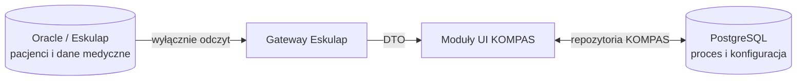
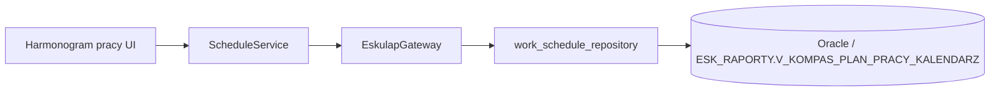

# Architektura modułów KOMPAS 1.0

Status: **Zatwierdzona i zamrożona**

Dokument stanowi punkt odniesienia dla kolejnych sprintów KOMPAS 1.0.
Opisuje docelowe granice modułów, a nie układ pojedynczych plików lub klas.

## Zatwierdzona struktura

```text
KOMPAS
├── Dashboard
├── Pacjenci / Epizody
├── Harmonogram
├── Programy
├── Ścieżki
├── Administracja
│   └── Ustawienia systemu
├── Gateway Eskulap
└── Pomoc
```

## Odpowiedzialności modułów

### Dashboard

Główny ekran pracy koordynatora. Prezentuje stan realizacji programów,
najbliższe zadania oraz elementy wymagające uwagi. Nie jest miejscem
definiowania programów, ścieżek ani ustawień systemowych.

### Pacjenci / Epizody

Obsługuje proces pacjenta w KOMPAS:

- listę i szczegóły epizodów;
- zadania należące do epizodu;
- postęp realizacji programu;
- powiązanie z technicznym identyfikatorem pacjenta w Eskulapie.

Dane osobowe i medyczne pacjenta nie są przechowywane w KOMPAS. Są
pobierane na żądanie przez Gateway Eskulap.

### Harmonogram

Prezentuje plan pracy i umożliwia wybór terminów dla zadań koordynatora.
Nie przejmuje odpowiedzialności za stan epizodu ani definicję ścieżki.
Moduł pobiera dane Eskulapa wyłącznie przez `ScheduleService`, który korzysta
z `EskulapGateway`. UI harmonogramu nie otwiera połączeń Oracle, nie zna
danych dostępowych i nie wykonuje SQL.

Źródłem danych harmonogramu jest widok tylko do odczytu
`ESK_RAPORTY.V_KOMPAS_PLAN_PRACY_KALENDARZ`. Moduł używa kolumn `JO_ID`,
`JO_SYMBOL`, `JO_NAZWA`, `DATA_DNIA`, `DATA_TEKST`, `DZIEN_TYG`,
`PRACOWNIK_ID`, `PRACOWNIK`, `GODZ_OD`, `GODZ_DO`, `PLN_ID`, `PLN_OPIS`
i `RODZAJE_WIZYT_KODY` oraz `RODZAJE_WIZYT`.

### Programy

Zarządza definicjami programów KOMPAS oraz ich dostępnością dla jednostek
organizacyjnych. Program jest nadrzędnym kontenerem konfiguracji procesu.

### Ścieżki

Zarządza przebiegiem programu:

- elementami i kolejnością procesu;
- biblioteką użytych klocków;
- terminami i warunkami;
- zależnościami i wyzwalaczami.

Moduł Ścieżki pozostaje dostępny w kontekście wybranego programu.

### Administracja

Administracja jest jednym punktem wejścia do konfiguracji KOMPAS.
Nie zawiera osobnych, rozproszonych okien konfiguracyjnych.

Wszystkie ustawienia administracyjne trafiają do:

```text
Administracja
└── Ustawienia systemu
    ├── Słowniki
    ├── Integracja Eskulap
    ├── Parametry systemu
    ├── Role i uprawnienia
    ├── Diagnostyka
    ├── Harmonogram usług
    ├── Powiadomienia
    └── Informacje o systemie
```

Kody systemowe, od których zależy logika aplikacji, nie mogą być dowolnie
zmieniane przez administratora.

### Gateway Eskulap

Jest jedyną publiczną warstwą dostępu aplikacji do danych Eskulapa.
Ukrywa przed UI szczegóły połączenia, zapytań oraz widoków Oracle i zwraca
modele DTO.

### Pomoc

Pomoc jest funkcją przekrojową dostępną w modułach. Obejmuje instrukcje
kontekstowe i dokumentację użytkową. Nie zawiera logiki biznesowej.

## Reguły zamrożonej architektury

1. **Nowy moduł może powstać tylko wtedy, gdy nie mieści się logicznie
   w żadnym z zatwierdzonych modułów.**
2. Rozbudowa funkcji w ramach istniejącej odpowiedzialności oznacza dodanie
   ekranu, zakładki, usługi lub repozytorium wewnątrz właściwego modułu,
   a nie utworzenie kolejnego modułu głównego.
3. Administracja nie zawiera osobnych rozproszonych okien
   konfiguracyjnych. Wszystkie ustawienia trafiają do „Ustawień systemu”.
4. Oracle/Eskulap jest źródłem danych medycznych i danych pacjenta.
5. PostgreSQL przechowuje wyłącznie dane procesowe i konfigurację KOMPAS.
6. PostgreSQL jest jedyną bazą procesową KOMPAS. Historyczny tryb SQLite
   nie jest wspierany i nie uczestniczy w działaniu aplikacji.
7. UI nie odwołuje się bezpośrednio do Oracle. Dostęp do Eskulapa odbywa
   się przez `EskulapGateway`.
   Dotyczy to również modułu Harmonogram pracy.
8. Repozytoria danych procesowych KOMPAS nie przechowują PESEL-u, imienia,
   nazwiska ani danych kontaktowych pacjenta.
9. Moduły UI nie powinny zawierać SQL ani szczegółów konkretnego silnika
   bazy danych.

## Granice danych



Przepływ danych Harmonogramu pracy:



Oracle nie jest modyfikowany przez KOMPAS. PostgreSQL nie jest źródłem
danych osobowych ani medycznych pacjenta.

## Zasada kwalifikowania nowych funkcji

Przed utworzeniem nowego modułu należy odpowiedzieć kolejno:

1. Czy funkcja dotyczy bieżącej pracy koordynatora? Jeśli tak, należy do
   Dashboardu, Pacjentów/Epizodów albo Harmonogramu.
2. Czy funkcja definiuje proces? Jeśli tak, należy do Programów lub Ścieżek.
3. Czy funkcja jest konfiguracją, diagnostyką albo zarządzaniem dostępem?
   Jeśli tak, należy do Administracji → Ustawienia systemu.
4. Czy funkcja pobiera dane Eskulapa? Jeśli tak, jej integracja należy do
   Gateway Eskulap, nawet gdy wynik jest prezentowany w innym module.
5. Czy funkcja jest instrukcją lub objaśnieniem? Jeśli tak, należy do Pomocy.

Dopiero brak logicznego dopasowania po przejściu tych pytań uzasadnia
propozycję nowego modułu. Taka propozycja wymaga osobnego ADR.

## Powiązane decyzje

- `docs/ADR/ADR-001-module-architecture-freeze.md`
- `docs/DATABASE_ARCHITECTURE.md`
- `docs/ARCHITECTURE/PRIVACY.md`
- `docs/API/ESKULAP_GATEWAY.md`
