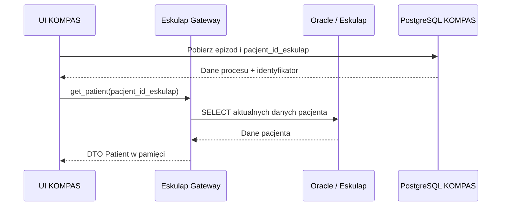

# Minimalizacja danych osobowych w KOMPAS

## Zasada źródła prawdy

Oracle / Eskulap jest jedynym źródłem prawdy o pacjencie. PESEL, imię,
nazwisko, data urodzenia, dane kontaktowe, adresowe oraz inne dane
identyfikacyjne nie są kopiowane do baz KOMPAS.

KOMPAS jest systemem zarządzania procesem diagnostyczno-terapeutycznym.
Przechowuje programy, ścieżki, epizody, zadania, statusy, terminy i
powiązania organizacyjne.

## Identyfikacja pacjenta

Epizod w docelowej bazie PostgreSQL zawiera wyłącznie:

- `pacjent_id_eskulap` — techniczny identyfikator rekordu w Eskulapie,
- `source_system` — system źródłowy zdarzenia,
- `source_id` — identyfikator zdarzenia źródłowego.

Identyfikator służy do pobrania aktualnego rekordu pacjenta z Oracle. Nie
jest podstawą do tworzenia lokalnej kartoteki pacjentów.

W developerskim schemacie SQLite historyczna nazwa kolumny to
`pk_epizody.pacjent_id`. Jej znaczenie jest identyczne: przechowuje
wyłącznie techniczny identyfikator Eskulapa. Zmiana nazwy w działającym
SQLite nastąpi wraz z kontrolowanym przepięciem repozytoriów w DB-PG-2,
bez zmiany znaczenia danych.

## Pobieranie danych na żądanie

Gateway pobiera dane pacjenta tylko wtedy, gdy są potrzebne. DTO `Patient`
może zawierać dane zwrócone przez Oracle, lecz nie jest encją trwałą i nie
jest przekazywany do repozytoriów zapisu PostgreSQL lub SQLite.

## Zakaz duplikowania

Repozytoria KOMPAS nie mogą tworzyć tabel ani kolumn przechowujących:

- PESEL,
- imię lub nazwisko,
- adres,
- telefon,
- adres e-mail,
- dane opiekuna,
- inne dane umożliwiające bezpośrednią identyfikację pacjenta.

Ewentualne nowe wymaganie dotyczące trwałego przechowywania takich danych
wymaga osobnej decyzji architektonicznej, analizy RODO oraz przeglądu
bezpieczeństwa.

## Minimalizacja danych i RODO

Architektura realizuje zasadę minimalizacji danych: KOMPAS przechowuje
tylko dane konieczne do obsługi procesu oraz techniczny identyfikator
rekordu źródłowego. Ogranicza to liczbę kopii danych osobowych, ryzyko ich
rozbieżności oraz zakres danych objętych potencjalnym incydentem.
