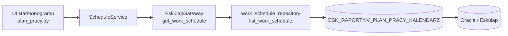

# Źródło danych harmonogramu pracy

## Rzeczywisty przepływ danych

Moduł **Harmonogram pracy / Kalendarz** pobiera dane planu pracy z Oracle
wyłącznie przez warstwę Gateway.

```text
UI Harmonogramu
→ ScheduleService
→ EskulapGateway.get_work_schedule(...)
→ work_schedule_repository.list_work_schedule(...)
→ ESK_RAPORTY.V_PLAN_PRACY_KALENDARZ
→ Oracle / Eskulap
```



`plan_pracy.py` nie wykonuje SQL i nie otwiera połączenia Oracle. UI zna
wyłącznie `ScheduleService`.

## Widok Oracle

| Właściwość | Wartość |
|---|---|
| Właściciel widoku | `ESK_RAPORTY` |
| Nazwa widoku | `V_PLAN_PRACY_KALENDARZ` |
| Pełna nazwa | `ESK_RAPORTY.V_PLAN_PRACY_KALENDARZ` |
| Tryb użycia | tylko odczyt, wyłącznie `SELECT` |
| Konfiguracja | `application.view_name` w `config.ini` |
| Wartość domyślna | `ESK_RAPORTY.V_PLAN_PRACY_KALENDARZ` |

`application.view_name` istnieje jako ustawienie techniczne dla środowisk,
ale zatwierdzonym źródłem harmonogramu KOMPAS jest
`ESK_RAPORTY.V_PLAN_PRACY_KALENDARZ`. Zmiana tej wartości w konfiguracji
powinna być traktowana jako odstępstwo architektoniczne i wymaga osobnej
decyzji technicznej.

## Używane kolumny

Repozytorium `work_schedule_repository` pobiera z widoku następujące kolumny:

- `JO_ID` — identyfikator jednostki organizacyjnej,
- `JO_SYMBOL` — symbol jednostki,
- `JO_NAZWA` — nazwa jednostki,
- `DATA_DNIA` — dzień planu pracy,
- `DZIEN_TYG` — dzień tygodnia,
- `PRACOWNIK_ID` — identyfikator pracownika,
- `PRACOWNIK` — nazwa prezentacyjna pracownika,
- `GODZ_OD` — początek pracy,
- `GODZ_DO` — koniec pracy,
- `PLN_ID` — identyfikator pozycji planu.

`ScheduleService` mapuje te wartości do `DataFrame` z kolumnami używanymi
przez `calendar_logic.py`. Logika kalendarza pozostaje czysta: nie zna
Oracle, SQL ani danych połączenia.

## Filtrowanie

Plan pracy jest filtrowany po:

- jednostce organizacyjnej:
  `JO_ID = :jo_id`,
- zakresie dat:
  `DATA_DNIA BETWEEN TO_DATE(:date_from, 'YYYY-MM-DD') AND TO_DATE(:date_to, 'YYYY-MM-DD')`,
- opcjonalnie po pracownikach:
  `PRACOWNIK_ID IN (...)`.

Wynik jest sortowany po:

```text
DATA_DNIA, GODZ_OD, PRACOWNIK
```

## Odpowiedzialności warstw

| Warstwa | Odpowiedzialność |
|---|---|
| `plan_pracy.py` | UI harmonogramu, wybór jednostki i dat, rysowanie tabeli |
| `ScheduleService` | walidacja zakresu dat, wywołanie Gateway, przygotowanie danych dla kalendarza |
| `EskulapGateway` | publiczna metoda `get_work_schedule(...)` |
| `work_schedule_repository` | wewnętrzny odczyt Oracle z widoku harmonogramu |
| `calendar_logic.py` | czysta transformacja dat i przedziałów godzinowych |

## Test strażniczy

Zgodność kodu z dokumentacją sprawdza:

```text
python scripts/test_schedule_data_source.py
```

Test kończy się błędem, jeżeli Harmonogram pracy omija `ScheduleService`,
omija `EskulapGateway` albo przestaje wskazywać na zatwierdzony widok
`ESK_RAPORTY.V_PLAN_PRACY_KALENDARZ`.
