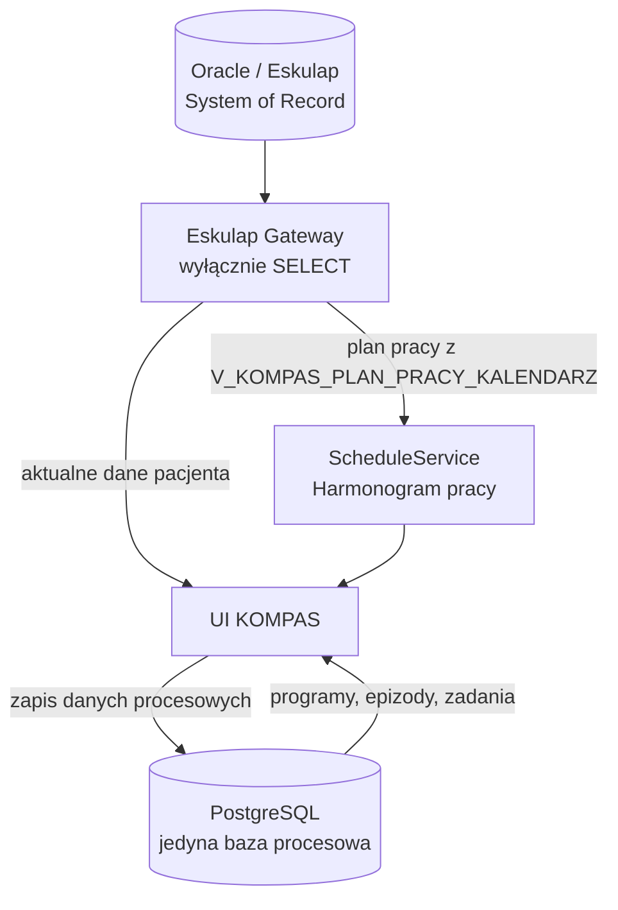

# Architektura baz danych KOMPAS

## Podział odpowiedzialności

KOMPAS korzysta z dwóch systemów danych:

| System | Rola | Zapis przez KOMPAS |
|---|---|---|
| Oracle / Eskulap | Dane pacjenta, medyczne i organizacyjne | Nie |
| PostgreSQL | Centralne dane procesowe i konfiguracja KOMPAS | Tak |

**PostgreSQL jest jedyną bazą procesową KOMPAS.**

SQLite został usunięty z mechanizmu działania aplikacji w DB-PG-3.
Historyczne pliki znajdują się w `db/sqlite_deprecated/`, nie są wspierane,
uruchamiane ani pakowane do EXE.

## Oracle / Eskulap

Oracle jest systemem źródłowym dla:

- danych pacjenta;
- danych medycznych;
- wizyt;
- konsultacji;
- badań;
- danych referencyjnych Eskulapa.

UI nie łączy się z Oracle bezpośrednio. Odczyt odbywa się przez
`EskulapGateway`. KOMPAS nie zapisuje nic do Oracle.

Moduł Harmonogram pracy również podlega tej zasadzie: pobiera plan pracy
z Eskulapa przez `ScheduleService` i `EskulapGateway`, a nie przez
bezpośrednie połączenie z Oracle w warstwie UI.

### Źródło danych harmonogramu pracy

Harmonogram pracy korzysta z widoku Oracle:

```text
ESK_RAPORTY.V_KOMPAS_PLAN_PRACY_KALENDARZ
```

Widok jest tylko do odczytu i służy do prezentowania planu pracy jednostki
organizacyjnej w kalendarzu. Przepływ danych:

```text
UI Harmonogramu
→ ScheduleService
→ EskulapGateway
→ ESK_RAPORTY.V_KOMPAS_PLAN_PRACY_KALENDARZ
→ Oracle / Eskulap
```

Używane kolumny widoku: `JO_ID`, `JO_SYMBOL`, `JO_NAZWA`, `DATA_DNIA`,
`DATA_TEKST`, `DZIEN_TYG`, `PRACOWNIK_ID`, `PRACOWNIK`, `GODZ_OD`,
`GODZ_DO`, `PLN_ID`, `PLN_OPIS`, `RODZAJE_WIZYT_KODY`, `RODZAJE_WIZYT`.
Popup kalendarza wyświetla nazwy z `RODZAJE_WIZYT`; kody są traktowane jako
dane techniczne.
Filtrowanie odbywa się po `JO_ID`, zakresie `DATA_DNIA` oraz opcjonalnie po
`PRACOWNIK_ID`.

Widok łączy `RI_OWNER.RI_PLAN_PRACY_NEW` z zagregowanymi warunkami z
`RI_OWNER.RI_PLAN_PRACY_WARUNKI_NEW`. Warunki są agregowane po `PLN_ID`,
aby wiele kodów `PLW_WP_PARAMETR` nie zwielokrotniało rekordów harmonogramu.

## PostgreSQL

PostgreSQL przechowuje:

- programy i ścieżki;
- słowniki KOMPAS;
- epizody i zadania;
- zależności i wyzwalacze;
- mapowania kodów referencyjnych Eskulapa na klocki procesu;
- użytkowników, role i przypisania jednostek;
- konfigurację procesów.

Epizod zawiera wyłącznie `pacjent_id_eskulap`, który służy do pobierania
aktualnych danych pacjenta z Oracle. PostgreSQL nie zawiera lokalnej
kartoteki pacjentów ani kopii ich danych osobowych.



## Połączenie aplikacji

Wszystkie repozytoria danych KOMPAS korzystają z
`app/repositories/db_connection.py`. Warstwa obsługuje wyłącznie PostgreSQL
i nie tworzy automatycznie bazy ani schematu.

Konfiguracja prywatnego `config.ini`:

```ini
[kompas_db]
engine=postgres
postgres_dsn=host=SERVER port=5432 dbname=kompas user=kompas_app password=HASLO
```

Zmienna `KOMPAS_POSTGRES_DSN` ma pierwszeństwo przed DSN zapisanym w pliku.
Brak DSN, błąd połączenia albo próba ustawienia `engine=sqlite` zatrzymuje
operację z czytelnym komunikatem i nigdy nie tworzy `kompas.db`.

## Kodowanie

Baza PostgreSQL KOMPAS musi być utworzona w kodowaniu `UTF8`. Skrypty
instalacyjne ustawiają `client_encoding = 'UTF8'`. `lc_collate` i
`lc_ctype` pozostają zgodne z lokalizacją wybraną podczas instalacji
PostgreSQL na Windows.

## Test

Podstawowy test warstwy danych:

```text
python scripts/test_db_postgres.py
```

Test live wymaga zmiennej:

```powershell
$env:KOMPAS_TEST_POSTGRES_DSN = "host=... dbname=kompas user=... password=..."
python scripts/test_db_postgres.py
```

Szczegółowe zasady minimalizacji danych opisuje
`docs/ARCHITECTURE/PRIVACY.md`.
## ADM-VISIT-DICT-1: lokalny słownik rodzajów wizyt

Rodzaje wizyt Eskulapa (`WP_PARAMETR`) są pobierane przez Gateway z widoku
`ESK_RAPORTY.V_KOMPAS_PARAMETRY_WIZYT` i synchronizowane do PostgreSQL do
tabeli `pk_rodzaje_wizyt_eskulap`. PostgreSQL przechowuje tylko słownik
referencyjny i mapowania do klocków procesu (`pk_mapowanie_wizyt`), bez
danych medycznych i bez danych osobowych pacjenta.

Relacja mapowania:

```text
PK_KLOCKI (1)
        ↓
PK_MAPOWANIE_WIZYT (N)
        ↓
PK_RODZAJE_WIZYT_ESKULAP
```

Jeden klocek może odpowiadać wielu rodzajom wizyt Eskulapa. Jeden rodzaj
wizyty może mieć tylko jedno aktywne przypisanie do klocka.

Popup harmonogramu pracy wyświetla nazwy rodzajów wizyt z `RODZAJE_WIZYT`.
Lokalny słownik PostgreSQL jest używany tylko jako fallback, gdy widok
harmonogramu zwróci kody bez nazw.

## Synchronizacja epizodów z Eskulap

Synchronizacja epizodów jest jednokierunkowa:

```text
Eskulap / Oracle
        ↓
Eskulap Gateway
        ↓
EpisodeSynchronizationService
        ↓
PostgreSQL KOMPAS
        ↓
Dashboard Koordynatora
```

KOMPAS nie zapisuje nic do Oracle. Wizyty pacjenta są pobierane przez Gateway
z `V_KOMPAS_WIZYTY`, a `WP_PARAMETR` jest dopasowywany do klocka procesu przez
aktywne rekordy `pk_mapowanie_wizyt`.

Reguły dopasowania:

- jedna wizyta Eskulapa może zostać przypisana tylko do jednego elementu
  epizodu,
- jeden element epizodu może mieć tylko jedną przypisaną wizytę,
- wizyty są przypisywane chronologicznie do pierwszych wolnych elementów
  danego klocka,
- `PKK_KWAL` jest oznaczany jako `ZREALIZOWANA`, bo kwalifikacja była warunkiem
  utworzenia epizodu.

Statusy automatyczne:

- `DECYZJA = 'J'` → `ZREALIZOWANA`,
- `DECYZJA = 'B'` → `ANULOWANA`,
- istnieje data planowana i brak realizacji → `ZAPLANOWANA`,
- brak wizyty → pozostaje dotychczasowy status.
