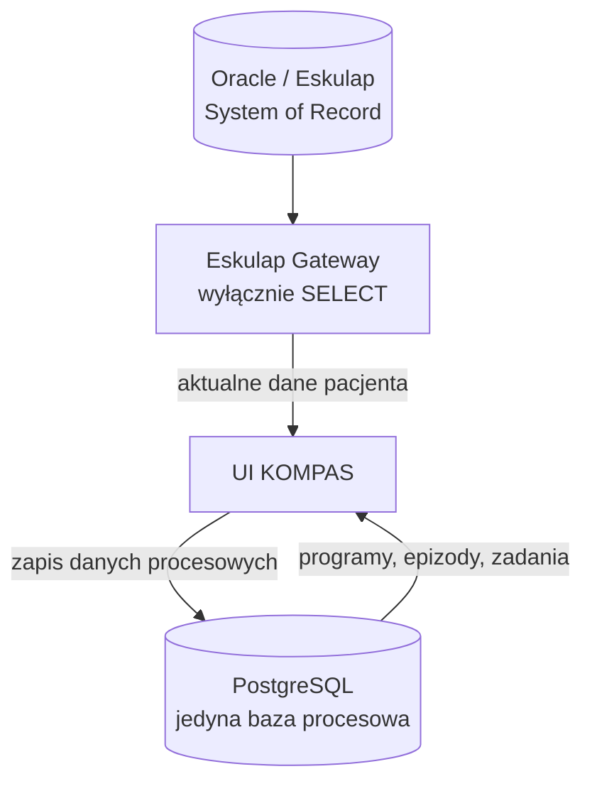

# Architektura baz danych KOMPAS

## Podział odpowiedzialności

KOMPAS korzysta z dwóch systemów danych:

| System | Rola | Zapis przez KOMPAS |
|---|---|---|
| Oracle / Eskulap | Dane pacjenta, medyczne i organizacyjne | Nie |
| PostgreSQL | Centralne dane procesowe i konfiguracja KOMPAS | Tak |

**PostgreSQL jest jedyną bazą procesową KOMPAS.**

SQLite został usunięty z mechanizmu działania aplikacji w DB-PG-3.
Historyczne pliki znajdują się w `db/sqlite_deprecated/`, nie są wspierane,
uruchamiane ani pakowane do EXE.

## Oracle / Eskulap

Oracle jest systemem źródłowym dla:

- danych pacjenta;
- danych medycznych;
- wizyt;
- konsultacji;
- badań;
- danych referencyjnych Eskulapa.

UI nie łączy się z Oracle bezpośrednio. Odczyt odbywa się przez
`EskulapGateway`. KOMPAS nie zapisuje nic do Oracle.

## PostgreSQL

PostgreSQL przechowuje:

- programy i ścieżki;
- słowniki KOMPAS;
- epizody i zadania;
- zależności i wyzwalacze;
- użytkowników, role i przypisania jednostek;
- konfigurację procesów.

Epizod zawiera wyłącznie `pacjent_id_eskulap`, który służy do pobierania
aktualnych danych pacjenta z Oracle. PostgreSQL nie zawiera lokalnej
kartoteki pacjentów ani kopii ich danych osobowych.



## Połączenie aplikacji

Wszystkie repozytoria danych KOMPAS korzystają z
`app/repositories/db_connection.py`. Warstwa obsługuje wyłącznie PostgreSQL
i nie tworzy automatycznie bazy ani schematu.

Konfiguracja prywatnego `config.ini`:

```ini
[kompas_db]
engine=postgres
postgres_dsn=host=SERVER port=5432 dbname=kompas user=kompas_app password=HASLO
```

Zmienna `KOMPAS_POSTGRES_DSN` ma pierwszeństwo przed DSN zapisanym w pliku.
Brak DSN, błąd połączenia albo próba ustawienia `engine=sqlite` zatrzymuje
operację z czytelnym komunikatem i nigdy nie tworzy `kompas.db`.

## Kodowanie

Baza PostgreSQL KOMPAS musi być utworzona w kodowaniu `UTF8`. Skrypty
instalacyjne ustawiają `client_encoding = 'UTF8'`. `lc_collate` i
`lc_ctype` pozostają zgodne z lokalizacją wybraną podczas instalacji
PostgreSQL na Windows.

## Test

Podstawowy test warstwy danych:

```text
python scripts/test_db_postgres.py
```

Test live wymaga zmiennej:

```powershell
$env:KOMPAS_TEST_POSTGRES_DSN = "host=... dbname=kompas user=... password=..."
python scripts/test_db_postgres.py
```

Szczegółowe zasady minimalizacji danych opisuje
`docs/ARCHITECTURE/PRIVACY.md`.
