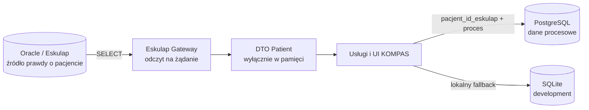

# Architektura baz danych KOMPAS

## Podział odpowiedzialności

KOMPAS korzysta z trzech niezależnych źródeł danych:

| System | Rola | Zapis przez KOMPAS |
|---|---|---|
| Oracle / Eskulap | Źródło danych medycznych i organizacyjnych | Nie |
| PostgreSQL | Centralne dane KOMPAS w testach i produkcji | Tak |
| SQLite | Tryb developerski i lokalny fallback | Tak |

Oracle pozostaje dostępny wyłącznie przez `EskulapGateway`. PostgreSQL nie
zastępuje Oracle i nie służy do modyfikowania danych Eskulapa.

**Dane pacjenta są zawsze pobierane z Oracle przez Eskulap Gateway.**

### Oracle / Eskulap

Oracle jest systemem źródłowym i przechowuje:

- dane pacjenta,
- dane medyczne,
- wizyty,
- konsultacje,
- badania.

KOMPAS korzysta z tych danych wyłącznie do odczytu przez Eskulap Gateway.

### PostgreSQL

PostgreSQL jest centralną bazą danych procesowych KOMPAS i przechowuje:

- programy,
- ścieżki,
- epizody,
- zadania,
- użytkowników,
- role,
- przypisania jednostek organizacyjnych,
- konfigurację procesów KOMPAS.

Nie zawiera kartoteki pacjentów ani kopii danych osobowych.

## PostgreSQL

Centralna baza przechowuje programy, ścieżki, elementy procesu, zależności,
wyzwalacze, epizody, zadania, konta, role oraz przypisania jednostek.
Epizod zawiera wyłącznie `pacjent_id_eskulap`, który pozwala pobrać
aktualne dane pacjenta z Oracle. Schemat znajduje się w `db/postgres/`.

Warstwa `app/repositories/db_connection.py` potrafi utworzyć połączenie
SQLite lub PostgreSQL na podstawie sekcji `[kompas_database]`. Obecne
repozytoria nie zostały jeszcze przepięte na tę warstwę; nastąpi to w
osobnym etapie migracji.

## SQLite

SQLite nadal jest domyślnym silnikiem developerskim. Dotychczasowy
`local_db.py`, baza `kompas.db` oraz istniejące repozytoria pozostają
niezmienione. Dzięki temu aktualna aplikacja działa lokalnie tak jak przed
dodaniem skryptów PostgreSQL.

Dotychczasowa kolumna SQLite `pk_epizody.pacjent_id` zawiera techniczny
identyfikator pacjenta z Eskulapa. Nie zawiera PESEL-u ani lokalnego
identyfikatora kartoteki KOMPAS. Przy przepięciu repozytoriów w DB-PG-2
odpowiada kolumnie PostgreSQL `pacjent_id_eskulap`.

## Dane pacjenta

PostgreSQL i SQLite nie utrzymują kopii PESEL-u, imienia, nazwiska, adresu,
telefonu, adresu e-mail ani innych danych identyfikacyjnych pacjenta.
Nie istnieje lokalny cache danych osobowych.

Model `Patient` jest obiektem DTO zwracanym przez Gateway i istnieje tylko
w pamięci procesu na czas obsługi żądania lub prezentacji danych. Nie jest
modelem trwałym i nie może być zapisywany przez repozytoria KOMPAS.

Szczegółowe zasady minimalizacji opisuje `docs/ARCHITECTURE/PRIVACY.md`.
